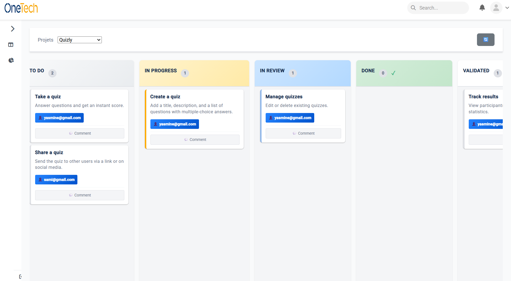
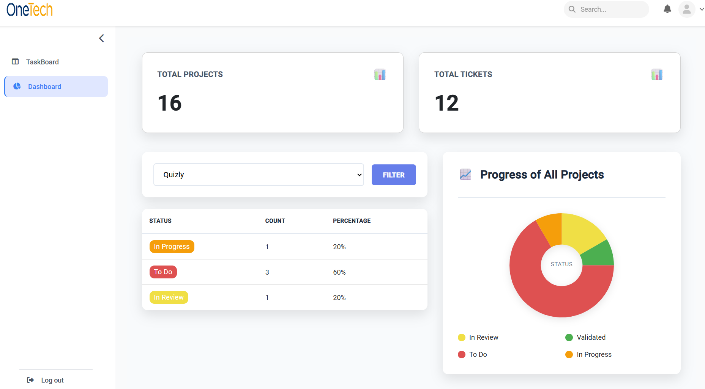
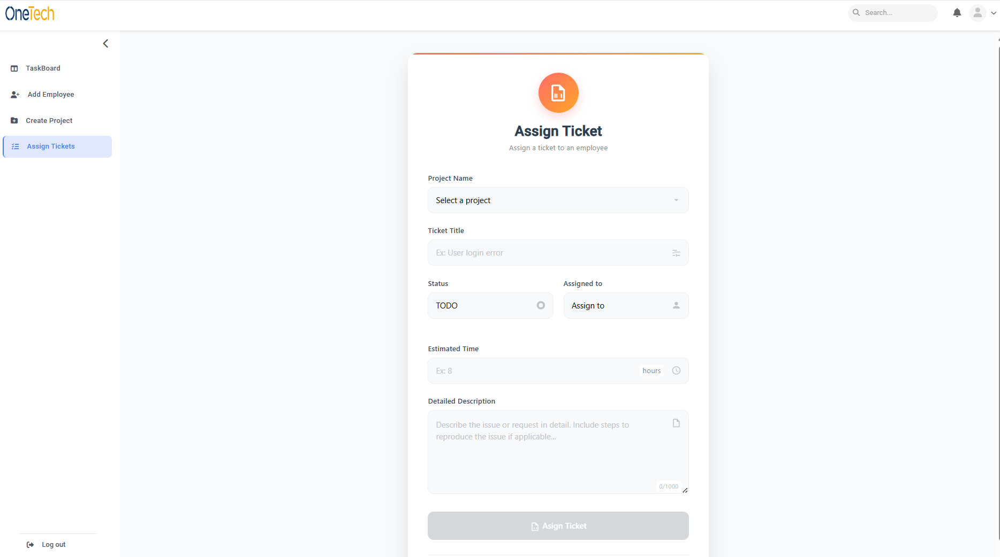

# 🚀 ProTask - Application Web de Gestion de Projets

ProTask est une solution web développée avec **Spring Boot**, **Angular**, **Keycloak** et **Docker**, permettant la gestion complète des projets et des tickets au sein d’une organisation.  
Elle facilite le suivi des tâches, la communication et la répartition des responsabilités selon les rôles utilisateurs.

---

## ✨ Fonctionnalités principales

- **Gestion des projets** : création, modification et suivi des projets.  
- **Gestion des tickets** : création, affectation et suivi des statuts des tickets.  
- **Tableau de bord en temps réel** : visualisation de l’avancement global (diagrammes, statistiques, filtres par projet).  
- **Communication par commentaires** : échanges directs entre administrateurs et employés.  
- **Gestion des accès par rôle** : sécurisation des fonctionnalités grâce à Keycloak.  

---

## 👥 Rôles et accès

- **Administrateur**  
  - Gérer les utilisateurs et leurs droits d’accès.  
  - Mettre à jour le statut des tickets selon l’avancement du travail.  
  - Ajouter des commentaires sur les tickets.  
  - Consulter le tableau de bord pour suivre la progression des projets (nombre total de projets, tickets, statuts).  
  - Cliquer sur un ticket pour consulter ses détails et ajouter un message à un employé.  

- **Manager**  
  - Créer de nouveaux projets via l’interface **Create Project**.  
  - Ajouter et assigner des tickets aux employés.  
  - Dans un projet existant, assigner directement un ticket via le bouton **Assign Ticket**.  
  - Ajouter un employé en saisissant une adresse e-mail et un mot de passe.  

- **Employé**  
  - Modifier le statut d’un ticket selon son avancement.  
  - Saisir le temps de travail (date + durée de la journée).  
  - Répondre aux commentaires de l’administrateur.  

---

## 🛠️ Technologies utilisées

- **Frontend** : Angular  
- **Backend** : Spring Boot  
- **Authentification & Sécurité** : Keycloak  
- **Conteneurisation** : Docker  

---

## 📸 Interfaces principales

### 🔹 TaskBoard


### 🔹 Dashboard


### 🔹 Assign Ticket



### 1. Cloner le projet
```bash
git clone https://github.com/Rihab-Souissi/stage_d-te_ProTask.git
cd stage_d-te_ProTask
